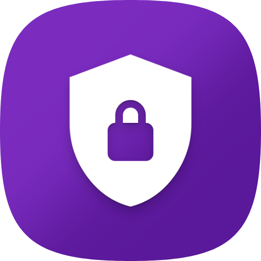

<div align="center">



# Keyra Authenticator — Desktop

**The premium 2FA desktop app. Neumorphic. Native. Fast.**

[](https://github.com/MbarkT3STO/Keyra-App/releases/tag/v1.4.0)
[](https://www.electronjs.org/)
[](https://www.typescriptlang.org/)
[](#download)
[](../LICENSE)

[📥 Download v1.4.0](https://github.com/MbarkT3STO/Keyra-App/releases/tag/v1.4.0) · [🌐 Web Vault](https://keyraapp.netlify.app/) · [🐛 Report Bug](https://github.com/MbarkT3STO/Keyra-App/issues)

</div>

---

## Overview

Keyra Desktop is a native **Electron** application that brings the full Keyra 2FA experience to Windows and macOS. It features a hand-crafted neumorphic UI, local AES encryption, cloud sync, QR code scanning, and auto-updates — all in a single installable package.

---

## Features

- 🎨 **Neumorphic UI** — pure dark & light mode with dynamic accent colors
- 🔐 **Local Encryption** — vault data encrypted at rest, never exposed
- ☁️ **Cloud Sync** — seamless cross-device vault synchronization
- 📷 **QR Code Scanner** — add accounts instantly by scanning setup QR codes
- 🔄 **Auto-Update** — silent background updates via `electron-updater`
- ⚡ **60fps Animations** — smooth, hardware-accelerated transitions
- 🛡️ **Secure Mode** — hide all OTP codes until explicitly revealed
- 🌙 **OLED Dark Mode** — true black theme for OLED displays

---

## Tech Stack

| Layer | Technology |
|---|---|
| Runtime | Electron 28 |
| Language | TypeScript 5 |
| Renderer | Vanilla TS + Custom CSS |
| OTP | TOTP (RFC 6238) |
| QR | `jsqr`, `qrcode` |
| Updates | `electron-updater` |
| Packaging | `electron-builder` |

---

## Project Structure

```
src/
├── main/          # Electron main process (window, IPC, updater)
├── renderer/      # UI layer (HTML, CSS, TypeScript)
│   ├── css/       # Neumorphic component styles
│   ├── assets/    # Icons and fonts
│   └── index.html # App shell
└── core/          # Shared business logic (TOTP, encryption, sync)
```

---

## Getting Started

### Prerequisites

- Node.js 18+
- npm 9+

### Install

```bash
cd Authenticator-Desktop
npm install
```

### Run in Development

```bash
npm start
```

### Build

```bash
# Build only (no packaging)
npm run build

# Package for Windows
npm run dist

# Package for macOS Intel
npm run dist:mac-intel

# Package for macOS Apple Silicon
npm run dist:mac-arm
```

---

## Download

| Platform | Installer |
|---|---|
| 🪟 Windows x64 | [Keyra-Authenticator-Setup-1.4.0.exe](https://github.com/MbarkT3STO/Keyra-App/releases/download/v1.4.0/Keyra-Authenticator-Setup-1.4.0.exe) |
| 🍎 macOS | [View Release](https://github.com/MbarkT3STO/Keyra-App/releases/tag/v1.4.0) |

---

## License

[Keyra Personal Use License](../LICENSE) — free for personal use, commercial use not permitted.

